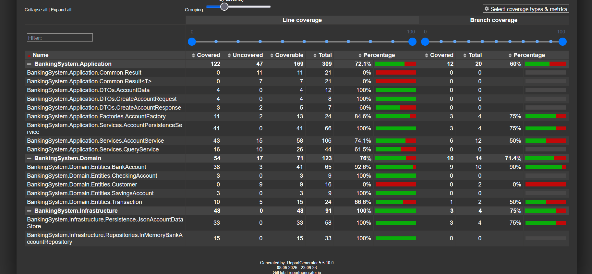

# FINAL REPORT

## Project Information

Project: Banking System

Course: Object-Oriented Programming

Project Type: Iterative Capstone Project

---

## Project Goal

The goal of the project was to develop a banking management system while demonstrating practical application of object-oriented programming, software architecture, testing, persistence, and software quality assurance techniques.

---

## Implemented Functionality

The final version supports:

- Account creation
- Deposits
- Withdrawals
- Transfers
- Persistence to JSON
- State restoration
- Analytical queries
- Automated testing

---

## Architecture

The project follows a layered architecture:

```text
Domain
Application
Infrastructure
Console
```

Benefits:

- separation of concerns;
- improved maintainability;
- easier testing;
- support for future extensions.

---

## Design Patterns

### Repository Pattern

Separates business logic from storage implementation.

### Factory Pattern

Provides extensible account creation logic.

---

## SOLID Principles

Implemented principles:

- Single Responsibility Principle
- Open/Closed Principle
- Dependency Inversion Principle

These principles improved maintainability and extensibility.

---

## Persistence

The system uses JSON files for persistence.

Implemented features:

- asynchronous save;
- asynchronous load;
- missing file handling;
- corrupted file handling.

---

## Testing

Testing includes:

### Unit Tests

Cover:

- domain invariants;
- account operations;
- business rules;
- factory behavior;
- analytical services.

### Integration Tests

Cover:

- persistence;
- state restoration;
- complete workflows;
- fault scenarios.

---

## Refactoring Activities

Performed improvements:

- reduced duplication;
- improved naming consistency;
- extracted responsibilities into dedicated services;
- improved dependency management.

---

## Performance Analysis

The repository uses:

```text
Dictionary<Guid, BankAccount>
```

This structure provides efficient account lookup operations and is more suitable than sequential list traversal for the current use cases.

No additional optimization was required for the project scope.

---

## Challenges

The most challenging parts were:

- persistence design;
- balancing simplicity and extensibility;
- designing meaningful integration tests;
- keeping documentation synchronized with implementation.

---

## Future Improvements

Potential future extensions:

- database persistence;
- user authentication;
- transaction history;
- notifications;
- concurrent transaction support.

---

## Test Coverage

Code coverage was measured using Coverlet and ReportGenerator.

Coverage results:



The most critical business components, persistence layer and repository implementations are covered by automated tests.

Coverage reports are generated as HTML reports and can be inspected through:

coverage-report/index.html

## Conclusion

The project successfully demonstrates integration of OOP principles, architectural patterns, testing techniques, persistence mechanisms, and software engineering practices within a single iterative software product.
