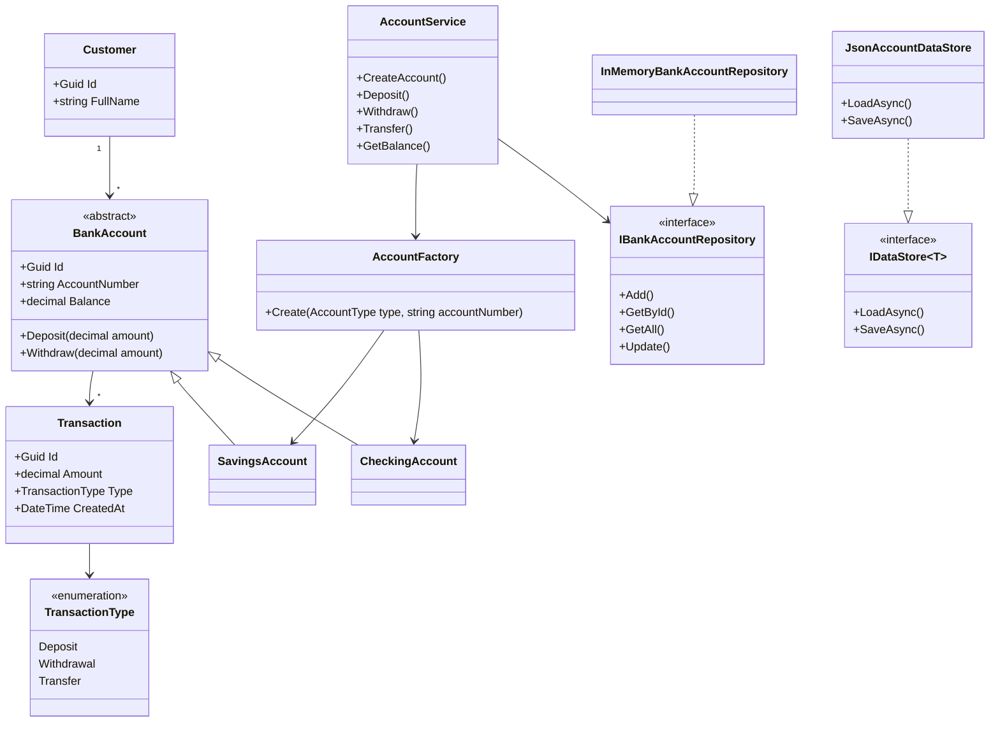

# Class Diagram

```mermaid
classDiagram

class Customer {
    +Guid Id
    +string FullName
}

class BankAccount {
    <<abstract>>
    +Guid Id
    +string AccountNumber
    +decimal Balance
    +Deposit(decimal amount)
    +Withdraw(decimal amount)
}

class CheckingAccount

class SavingsAccount

class Transaction {
    +Guid Id
    +decimal Amount
    +TransactionType Type
    +DateTime CreatedAt
}

class AccountService {
    +CreateAccount()
    +Deposit()
    +Withdraw()
    +Transfer()
    +GetBalance()
}

class AccountFactory {
    +Create(AccountType type, string accountNumber)
}

class IBankAccountRepository {
    <<interface>>
    +Add()
    +GetById()
    +GetAll()
    +Update()
}

class IDataStore~T~ {
    <<interface>>
    +LoadAsync()
    +SaveAsync()
}

class JsonAccountDataStore {
    +LoadAsync()
    +SaveAsync()
}

class InMemoryBankAccountRepository

class TransactionType {
    <<enumeration>>
    Deposit
    Withdrawal
    Transfer
}

Customer "1" --> "*" BankAccount

BankAccount <|-- CheckingAccount
BankAccount <|-- SavingsAccount

BankAccount --> "*" Transaction

Transaction --> TransactionType

AccountService --> IBankAccountRepository
AccountService --> AccountFactory

InMemoryBankAccountRepository ..|> IBankAccountRepository

JsonAccountDataStore ..|> IDataStore

AccountFactory --> CheckingAccount
AccountFactory --> SavingsAccount
```
