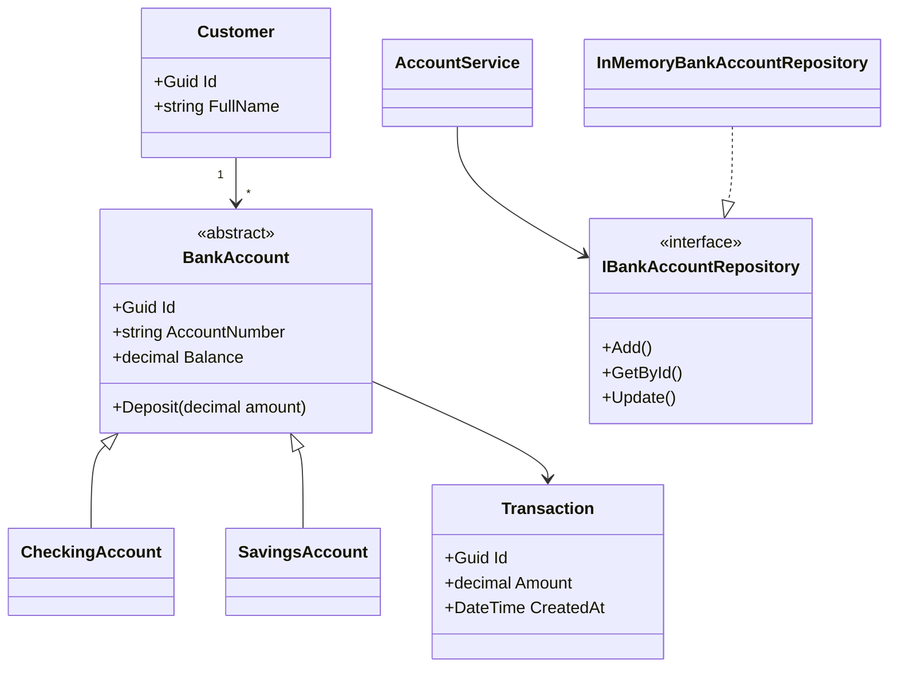

# Class Diagram

```mermaid
classDiagram

class Customer {
    +Guid Id
    +string FullName
}

class BankAccount {
    <<abstract>>
    +Guid Id
    +string AccountNumber
    +decimal Balance
    +Deposit(decimal amount)
}

class CheckingAccount

class SavingsAccount

class Transaction {
    +Guid Id
    +decimal Amount
    +DateTime CreatedAt
}

class AccountService

class IBankAccountRepository {
    <<interface>>
    +Add()
    +GetById()
    +Update()
}

class InMemoryBankAccountRepository

Customer "1" --> "*" BankAccount

BankAccount <|-- CheckingAccount
BankAccount <|-- SavingsAccount

AccountService --> IBankAccountRepository
InMemoryBankAccountRepository ..|> IBankAccountRepository

BankAccount --> Transaction
```
