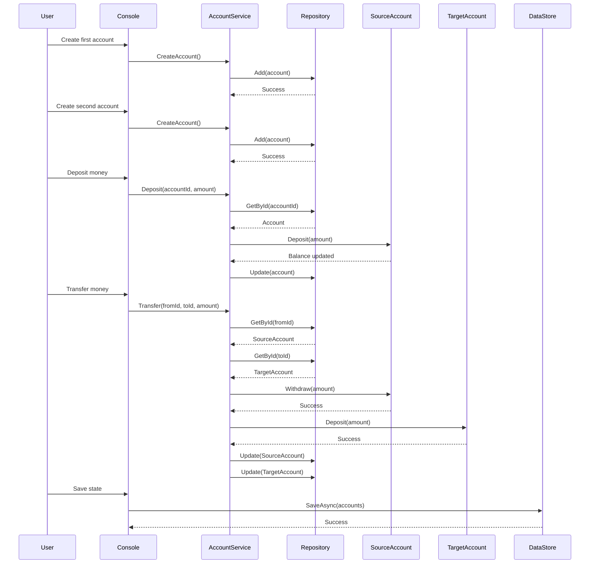

# Sequence Diagram

## Transfer Money And Save State

```mermaid
sequenceDiagram

participant User
participant Console
participant AccountService
participant Repository
participant SourceAccount
participant TargetAccount
participant DataStore

User->>Console: Create first account
Console->>AccountService: CreateAccount()
AccountService->>Repository: Add(account)
Repository-->>AccountService: Success

User->>Console: Create second account
Console->>AccountService: CreateAccount()
AccountService->>Repository: Add(account)
Repository-->>AccountService: Success

User->>Console: Deposit money
Console->>AccountService: Deposit(accountId, amount)

AccountService->>Repository: GetById(accountId)
Repository-->>AccountService: Account

AccountService->>SourceAccount: Deposit(amount)
SourceAccount-->>AccountService: Balance updated

AccountService->>Repository: Update(account)

User->>Console: Transfer money

Console->>AccountService: Transfer(fromId, toId, amount)

AccountService->>Repository: GetById(fromId)
Repository-->>AccountService: SourceAccount

AccountService->>Repository: GetById(toId)
Repository-->>AccountService: TargetAccount

AccountService->>SourceAccount: Withdraw(amount)
SourceAccount-->>AccountService: Success

AccountService->>TargetAccount: Deposit(amount)
TargetAccount-->>AccountService: Success

AccountService->>Repository: Update(SourceAccount)
AccountService->>Repository: Update(TargetAccount)

User->>Console: Save state

Console->>DataStore: SaveAsync(accounts)

DataStore-->>Console: Success
```
