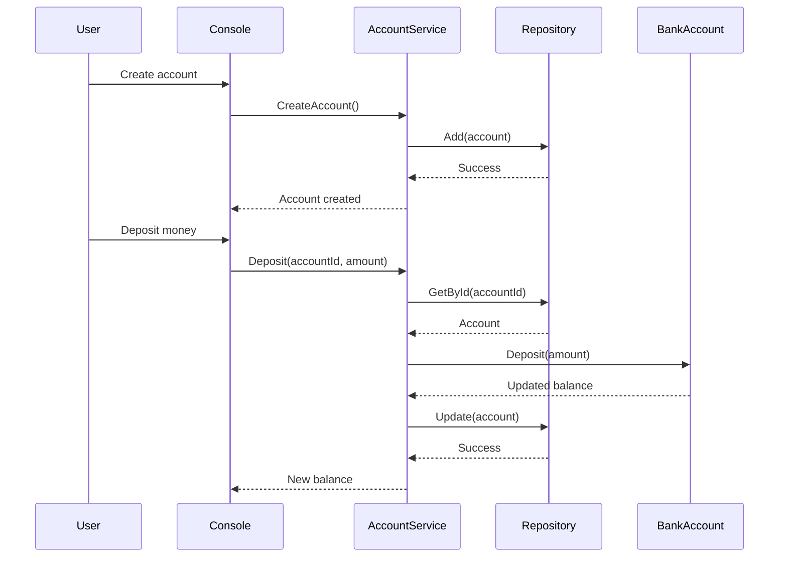

# Sequence Diagram

## Create Account And Deposit

```mermaid
sequenceDiagram

participant User
participant Console
participant AccountService
participant Repository
participant BankAccount

User->>Console: Create account
Console->>AccountService: CreateAccount()
AccountService->>Repository: Add(account)
Repository-->>AccountService: Success
AccountService-->>Console: Account created

User->>Console: Deposit money
Console->>AccountService: Deposit(accountId, amount)
AccountService->>Repository: GetById(accountId)
Repository-->>AccountService: Account
AccountService->>BankAccount: Deposit(amount)
BankAccount-->>AccountService: Updated balance
AccountService->>Repository: Update(account)
Repository-->>AccountService: Success
AccountService-->>Console: New balance
```
